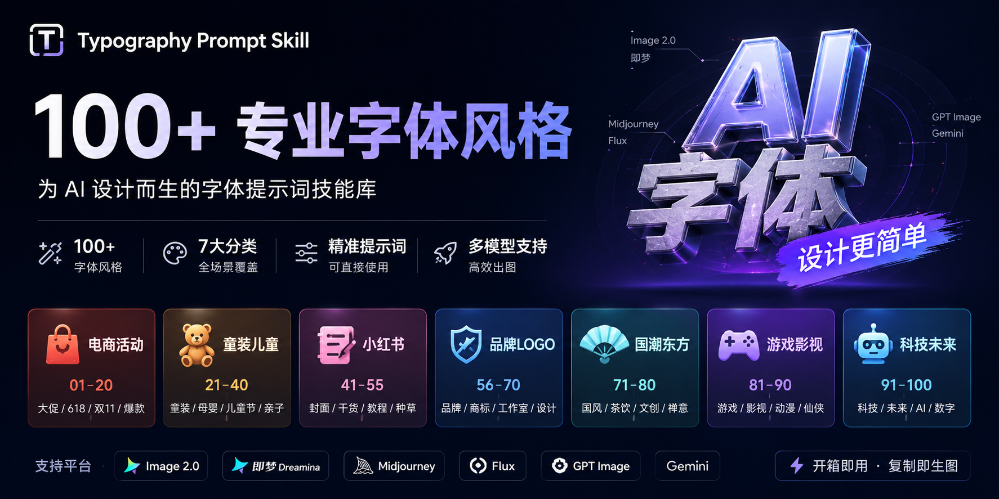

  

  

# Typography Prompt Skill

100+ Professional Typography Styles

A typography prompt skill library for AI image generation.
# typography-prompt-skill
A typography prompt skill library for AI image generation, focused on ecommerce, kidswear, logo, Xiaohongshu, oriental, game, and futuristic type styles.
# Typography Prompt Skill

一个面向 AI 字体设计的 Prompt Skill。

支持：

- 电商活动字体
- 童装儿童字体
- 小红书封面字体
- 品牌LOGO字体
- 国潮东方字体
- 游戏影视字体
- 科技未来字体

## 使用方式

输入：

“帮我用童装活动风格，为「夏日开玩」生成4套字体设计提示词。”

输出：

- 推荐风格
- 字体结构
- 材质工艺
- 色彩建议
- Image 2.0 提示词
- 即梦提示词
- Midjourney 提示词

## 文件结构

- `SKILL.md`：Skill 使用规则
- `data/style-library.json`：100个字体风格库
- `docs/style-library.md`：人类可读版本
- `examples/`：示例

## License

Typography Prompt Skill

100+ Typography Styles

A. 电商活动
B. 童装儿童
C. 小红书
D. 品牌LOGO
E. 国潮东方
F. 游戏影视
G. 科技未来

支持：

Image 2
即梦
Flux
Midjourney
GPT Image
